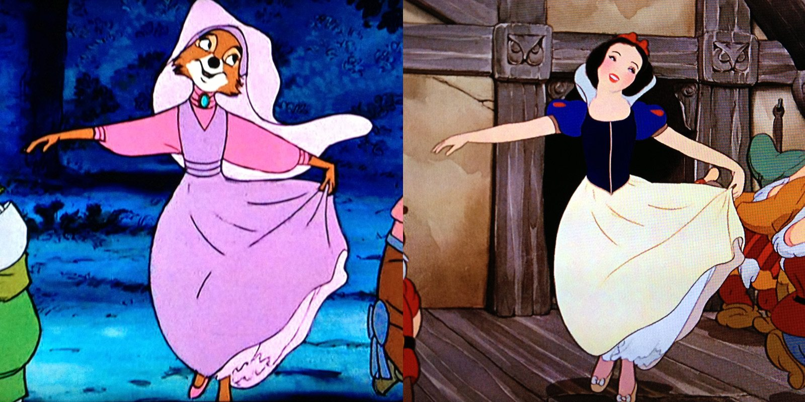

# C++ Commons
This CMake-based project contains functions I use frequently while programming in C++. 
Occasionally this library will be expanded by me over time.

## Reusability - Don't Repeat Yourself

The idea of ​​code reuse is not new and is embraced by many successful companies and personalities. 
For example, as early as the 1930s, Walt Disney bet on animation reuse to save time and resources while increasing the quality of its productions. 

In software development, too, code reuse is an important part of efficient and effective work processes. 

Using this project allows you to save time and effort by reusing commonly used features and focusing on developing 
unique aspects of your project.

---
Feel free to use this repository or make interesting pull requests.
